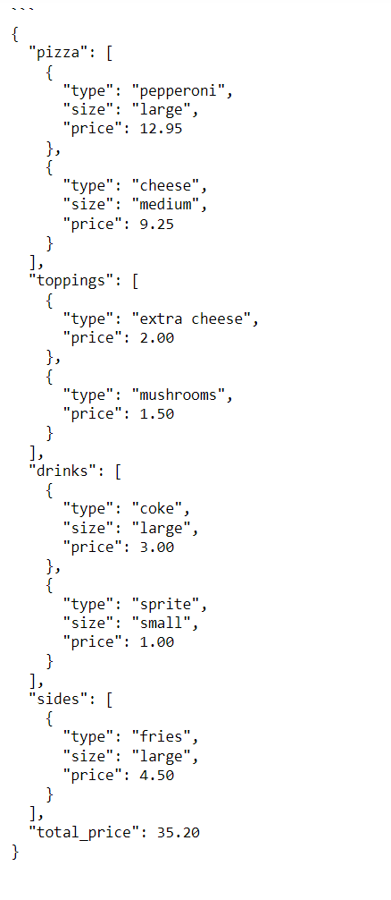

## ChatGPT Prompt Engineering for Developers 
### Course Sections:

1. Introduction </br>
2. Guidelines </br>
3. Iterative </br>
4. Summarizing </br>
5. Inferring </br>
6. Transforming </br>
7. Expanding </br>
8. Chatbox </br>

## Section 1: Introduction
### Two types of large language models (LLMs)

1) **Base LLM:** Predicts next word, based on text training data

</br>

   Example:

    Input: Once upon a time, there was a unicorn

    Output: that lived in a magical forest with all her unicorn friends

</br>

2) **Instruction Tuned LLM:** Tries to follow instructions, fine-tune on instructions and good attempts at following those instructions.

RLHF: Reinforcement learning with Human Feedback 

</br>

  Example:

     Input: What is the capital of France?

     Output: The capital of France is Paris
     
     
### To install chatGPT

      !pip install openai
      

## Section 2: Guidelines

### Two Principles of Prompting

</br>

#### Principle 1: Write clear and specific instructions

**Tactic 1:** Use delimeters

```
    Triple quotes: """
    Triple backticks: ```
    Triple dashes: ---
    Angle brackets: <>
    XML tags: <tag> </tag>
```

**Tactic 2:** Ask for structured output

```
HTML, JSON
```

**Tactic 3:** Check whether conditions are satisfied 

```
Check assumptions required to do the task
```


**Tactic 4:** Few-shot prompting

```
Give successful examples of completing task, then ask model to perform the task
```

</br>

#### **Principle 2: Give the model time to think**

**Tactic 1:** Specify the steps to complete a task

```
    Step 1: ...
    Step 2: ...
    ...
    Step N: ...
```

**Tactic 2:** Instruct the model to work out its own solution before rushing to a conclusion

</br>

### Model Limitations

</br>

**Hallucination:** Makes statements that sound plausible but are not true

**Reducing hallucinations:** First find relevant information, then answer the question based on the relevant information


</br>


## Section 3: Iterative

### Iterative Prompt Development

**Prompt Guidelines:**
```
- Be clear and specific
- Analyze why result does not give desired output.
- Refine the idea and the prompt.
- Repeat.
```
</br>

**Iterative Process:**
```
- Try something.
- Analyze where the result does not give you what you want.
- Clarify instructions, give more time to think.
- Refine prompts with a batch of examples.
```


## Section 4: Summarizing


## Section 5: Inferring


## Section 6: Transforming


## Section 7: Expanding


## Section 8: Chatbot

Three roles in the messages
```
1. System: Sets behavior of assistant
2. Assistant: Chat model
3. User: You
```

### Chatbot

Example:
```
messages =  [  
{'role':'system', 'content':'You are friendly chatbot.'},    
{'role':'user', 'content':'Hi, my name is Isa'}  ]
response = get_completion_from_messages(messages, temperature=1)
print(response)
```
Output: Hi Isa! How can I assist you today?

</br>

Example:
```
messages =  [  
{'role':'system', 'content':'You are friendly chatbot.'},
{'role':'user', 'content':'Hi, my name is Isa'},
{'role':'assistant', 'content': "Hi Isa! It's nice to meet you. \
Is there anything I can help you with today?"},
{'role':'user', 'content':'Yes, you can remind me, What is my name?'}  ]
response = get_completion_from_messages(messages, temperature=1)
print(response)
```
Output: Of course, your name is Isa!

</br>

### Orderbot

Automate the collection of user prompt and assistant responses to build a OrderBot.


Summarize the order as a json format and input to the system


