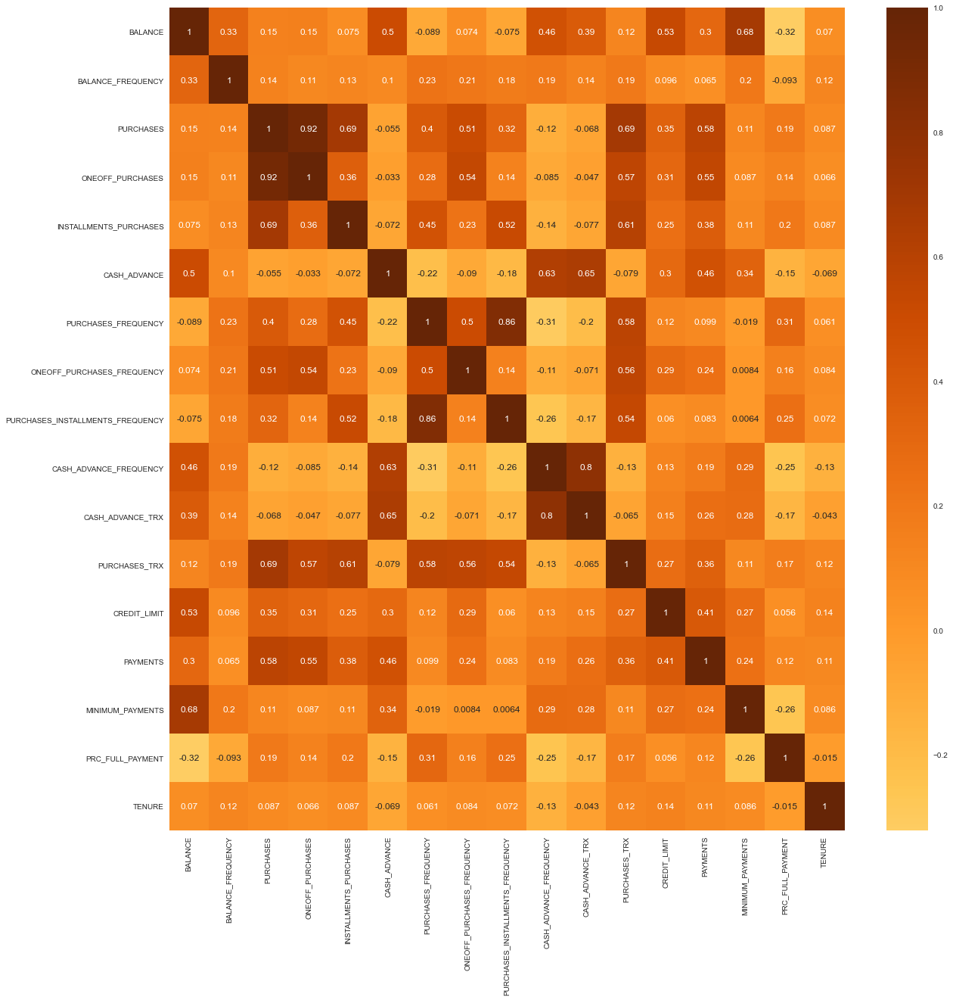

## Clustering analysis in a Credit Card customer dataset

**Project goal:** The goal of this project is to perform clustering analysis in a credit card customer dataset, which can provide business insight and values by using different marketing strategies to each customer groups.

### Columns in dataset

(1) CUST_ID  
(2) BALANCE  
(3) BALANCE_FREQUENCY  
(4) PURCHASES  
(5) ONEOFF_PURCHASES  
(6) INSTALLMENTS_PURCHASES  
(7) CASH_ADVANCE  
(8) PURCHASES_FREQUENCY  
(9) ONEOFF_PURCHASES_FREQUENCY  
(10) PURCHASES_INSTALLMENTS_FREQUENCY  
(11) CASH_ADVANCE_FREQUENCY  
(12) CASH_ADVANCE_TRX  
(13) PURCHASES_TRX  
(14) CREDIT_LIMIT  
(15) PAYMENTS  
(16) MINIMUM_PAYMENTS  
(17) PRC_FULL_PAYMENT  
(18) TENURE  

### Fill in Missing values

There are some missing values in the credit_limit and minimum payments columns. Due to these columns are numerical variables, I will just fill in the mean values in the missing rows.

### Plotting the columns

### Removing outliers

I checked the mean and standard deviation of each columns. Then, the upper limit is calculated as [mean + 3 * standard deviation] and the lower limit is calculated as [mean - 3 * standard deviation]. The outliers are the rows that have values either lower than lower limit or higher than upper limit. There are a total of 102 outliers removed from this process.

### Correlation matrix

We can see there are some columns highly correlated with others, such as **oneoff purchases** is highly correlated with **purchases**, **purchases frequency** is highly correlated with **purchases installment frequency**, and **cash advance frequency** is highly correlated with **cash advance trx**.
